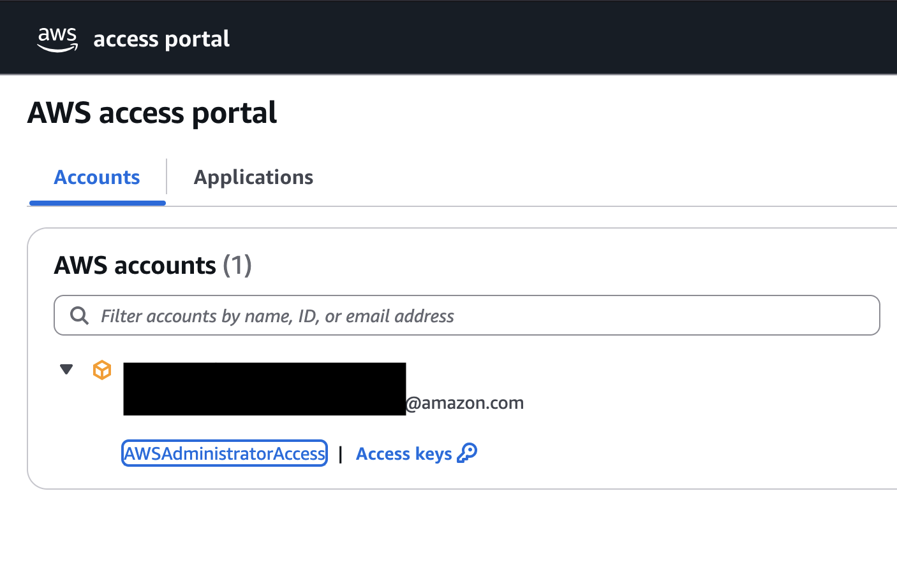
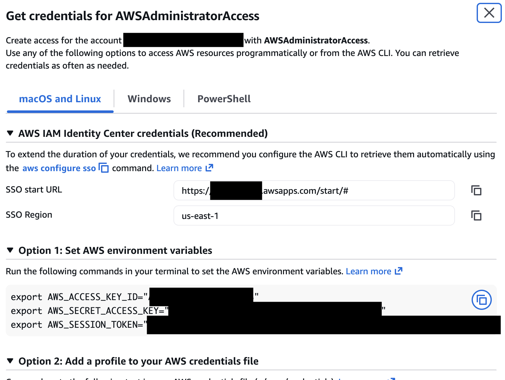

<!-- Copyright Amazon.com, Inc. or its affiliates. All Rights Reserved. -->
<!-- SPDX-License-Identifier: MIT-0 -->

[← Back to Main README](../../README.md)

# AWS Credentials Setup

There are two ways to authenticate with AWS for deployment. Use whichever works best for you.

---

## Option A: Copy credentials from the Access Portal (Quick)

Good for one-off deployments or if you haven't set up SSO profiles yet.

## Option B: AWS CLI SSO Login (Recommended for repeated use)

Uses `aws sso login` — no copy/pasting credentials, and they auto-refresh. See the [AWS CLI Sign-in with IAM Identity Center guide](https://docs.aws.amazon.com/signin/latest/userguide/command-line-sign-in.html#command-line-sign-in-sso) for full setup instructions.

```bash
# One-time setup
aws configure sso

# Then for each session
aws sso login --profile your-profile-name

# Verify
aws sts get-caller-identity --profile your-profile-name
```

Once configured, pass `--profile your-profile-name` to AWS CLI commands, or set it as default:
```bash
export AWS_PROFILE=your-profile-name
```

---

## Option A: Access Portal Credentials

## Why Identity Center?

✅ **Temporary credentials** - Automatically expire (more secure)  
✅ **No long-term keys** - No access keys to manage or rotate  
✅ **Centralized access** - Single sign-on across AWS accounts  
✅ **Easy to use** - Get credentials directly from AWS Console  
✅ **Automatic rotation** - Credentials refresh automatically  

---

## Prerequisites

Before starting, ensure you have:
- Access to AWS Console via IAM Identity Center
- **AdministratorAccess** permission set assigned to your account
- The AWS account ID where you'll deploy GROW2

> **Note:** If you don't have Identity Center access, contact your AWS administrator.

---

## Step 1: Login to AWS Identity Center

1. Go to your organization's AWS access portal URL (provided by your admin)
   - Example: `https://your-org.awsapps.com/start`

2. Sign in with your Identity Center credentials

3. You'll see a list of AWS accounts you have access to

---

## Step 2: Get Access Keys

1. Find the AWS account where you want to deploy GROW2

2. Click on the account name to expand it

3. You'll see your permission set (should be **AWSAdministratorAccess**)

4. Click **"Access keys"** next to AWSAdministratorAccess



5. A dialog titled **"Get credentials for AWSAdministratorAccess"** will appear



---

## Step 3: Copy Credentials for Your Operating System

After clicking "Access keys", you'll see a dialog titled **"Get credentials for AWSAdministratorAccess"**.

The dialog has three tabs at the top:
- **macOS and Linux** (default)
- **Windows**
- **PowerShell**

### What You'll See

The dialog shows:
- **SSO start URL** - Your organization's Identity Center URL
- **SSO Region** - The region for your Identity Center (e.g., us-east-1)
- **Option 1: Set AWS environment variables** ⬅️ **USE THIS OPTION**
- Option 2: Add a profile to your AWS credentials file (alternative method)

### For macOS / Linux Users

1. Click the **"macOS and Linux"** tab (should be selected by default)
2. Under **"Option 1: Set AWS environment variables"**, you'll see three export commands:
   ```bash
   export AWS_ACCESS_KEY_ID="ASIA..."
   export AWS_SECRET_ACCESS_KEY="..."
   export AWS_SESSION_TOKEN="..."
   ```
3. Click the **copy icon** (📋) on the right side to copy all three commands
4. Open **Terminal** (macOS) or your shell (Linux)
5. **Paste** the commands and press **Enter**

### For Windows PowerShell Users

1. Click the **"PowerShell"** tab at the top
2. Under **"Option 1: Set AWS environment variables"**, you'll see three commands:
   ```powershell
   $Env:AWS_ACCESS_KEY_ID="ASIA..."
   $Env:AWS_SECRET_ACCESS_KEY="..."
   $Env:AWS_SESSION_TOKEN="..."
   ```
3. Click the **copy icon** (📋) to copy all three commands
4. Open **PowerShell** (not Command Prompt!)
5. **Paste** the commands and press **Enter**

### For Windows Command Prompt Users

1. Click the **"Windows"** tab at the top
2. Under **"Option 1: Set AWS environment variables"**, you'll see three set commands:
   ```cmd
   set AWS_ACCESS_KEY_ID=ASIA...
   set AWS_SECRET_ACCESS_KEY=...
   set AWS_SESSION_TOKEN=...
   ```
3. Click the **copy icon** (📋) to copy all three commands
4. Open **Command Prompt**
5. **Paste** the commands and press **Enter**

> **💡 Tip:** Use the copy icon (📋) on the right side of the dialog to copy all commands at once - don't try to copy them manually!

---

## Step 4: Verify Credentials

After setting the credentials, verify they work:

```bash
aws sts get-caller-identity
```

**Expected output:**
```json
{
    "UserId": "AIDA...:your-email@example.com",
    "Account": "123456789012",
    "Arn": "arn:aws:sts::123456789012:assumed-role/AWSReservedSSO_AdministratorAccess_.../your-email@example.com"
}
```

✅ If you see your account ID and ARN, credentials are working!  
❌ If you see an error, see [Troubleshooting](#troubleshooting) below.

---

## Step 5: Check Region

Verify you're in the correct AWS region:

```bash
aws configure get region
```

**If no region is set:**
```bash
# Set default region (choose us-east-1 or us-west-2 for Bedrock)
aws configure set region us-east-1
```

---

## Important Notes

### Credential Expiration

⏰ **Identity Center credentials expire after 1-12 hours** (configured by your admin)

When credentials expire:
1. You'll see authentication errors
2. Return to Identity Center access portal
3. Click "Access keys" again to get fresh credentials
4. Paste new credentials in your terminal

### Multiple Terminal Windows

🪟 **Credentials are per-terminal session**

If you open a new terminal window:
- You must paste the credentials again
- Or add them to your shell profile (not recommended for temporary credentials)

### Security Best Practices

🔒 **Never commit credentials to Git**
- Credentials are temporary but still sensitive
- Don't save them in files
- Don't share them with others
- Let them expire naturally

---

## Troubleshooting

### Error: "Unable to locate credentials"

**Cause:** Credentials not set in current terminal session

**Solution:**
1. Go back to Identity Center
2. Click "Access keys" again
3. Copy and paste credentials for your OS
4. Verify with `aws sts get-caller-identity`

### Error: "The security token included in the request is expired"

**Cause:** Credentials have expired (typically after 1-12 hours)

**Solution:**
1. Return to Identity Center access portal
2. Click "Access keys" to get fresh credentials
3. Paste new credentials in terminal

### Error: "An error occurred (AccessDenied)"

**Cause:** Your permission set doesn't have required permissions

**Solution:**
1. Verify you have **AdministratorAccess** permission set
2. Contact your AWS administrator if you don't have sufficient permissions
3. GROW2 deployment requires admin-level permissions for:
   - Creating IAM roles
   - Deploying CloudFormation stacks
   - Creating Bedrock agents
   - Setting up networking resources

### Wrong AWS Account

**Cause:** Credentials are for a different AWS account

**Solution:**
1. Run `aws sts get-caller-identity` to see current account
2. If wrong account, get credentials from correct account in Identity Center
3. Verify account ID matches where you want to deploy

### Region Issues

**Cause:** AWS CLI not configured for correct region

**Solution:**
```bash
# Check current region
aws configure get region

# Set region (use us-east-1 or us-west-2 for Bedrock)
aws configure set region us-east-1

# Verify
aws configure get region
```

---

## Next Steps

Once credentials are verified:

1. ✅ Credentials working: `aws sts get-caller-identity` succeeds
2. ✅ Region set: `aws configure get region` shows us-east-1 or us-west-2
3. ✅ Ready to deploy: Proceed to [Quick Start Deployment](../../README.md#quick-start-deployment)

---

## Additional Resources

- [AWS IAM Identity Center Documentation](https://docs.aws.amazon.com/singlesignon/latest/userguide/what-is.html)
- [AWS CLI Configuration](https://docs.aws.amazon.com/cli/latest/userguide/cli-configure-files.html)
- [Temporary Security Credentials](https://docs.aws.amazon.com/IAM/latest/UserGuide/id_credentials_temp.html)

---

**Last Updated:** February 4, 2026
